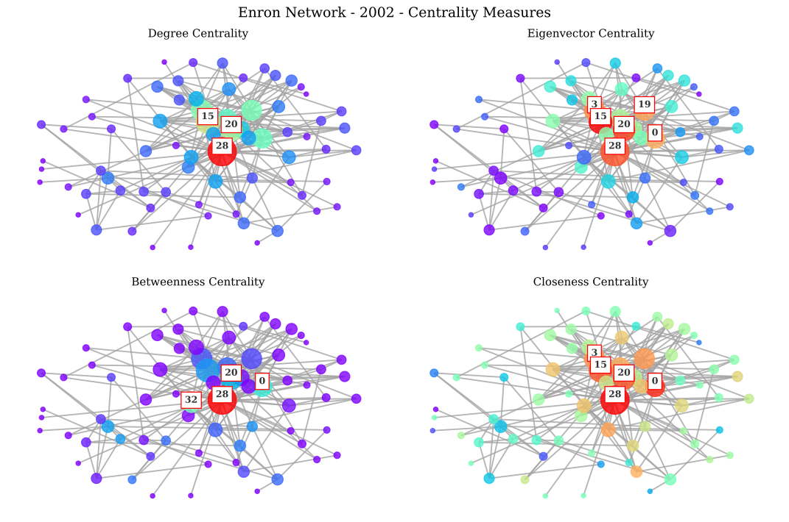
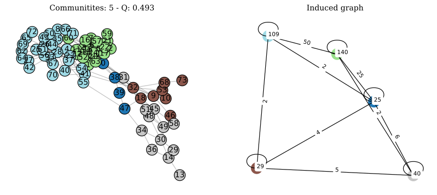

# Enron Email Network Analysis

## Project Overview
This project presents a comprehensive analysis of the Enron email corpus to identify pivotal figures and network dynamics related to the Enron scandal. Utilizing advanced network analysis techniques, the study integrates centrality measures, community detection, and temporal analysis to pinpoint influential individuals within the Enron network.

## Key Features
- Data Preprocessing: Employed thorough cleaning and preparation of the Enron email dataset.
- Network Analysis: Applied centrality measures (degree, betweenness, closeness, eigenvector) to determine influential nodes.
- Temporal Analysis: Investigated network changes over time, focusing on critical activity periods.
- Community Detection: Implemented algorithms to discover interconnected groups and their roles.
- Validation: Cross-referenced findings with actual convicted individuals to validate the model's accuracy.

## Initial Setup and Installations

To get started with this project, you'll need to set up your environment and install the necessary libraries. Follow the steps below:

#### Prerequisites

Make sure you have Python installed on your system. If not, you can download it from [Python's official website](https://www.python.org/downloads/).

#### Libraries Installation

You can install the required Python libraries by running the following command in your terminal or command prompt:

```bash
pip install pandas numpy matplotlib networkx seaborn python-louvain
```

#### Code Dependencies

The code relies on the following Python libraries:

```python
import pandas as pd
import numpy as np
import re
import matplotlib.pyplot as plt
from collections import Counter, defaultdict
import networkx as nx
import seaborn as sns
from scipy import integrate, optimize
from community import community_louvain
from warnings import filterwarnings
```

#### Jupyter Notebook Configuration

If you're working with Jupyter Notebooks, include the following commands to enhance visualization and handle warnings:

```python
%matplotlib inline
%config InlineBackend.figure_format = 'svg'
filterwarnings('ignore')
```

#### Customizing Matplotlib

To improve the readability of your visualizations, you can customize Matplotlib's font settings:

```python
plt.rcParams.update({'font.size': 10, 'font.style': 'normal', 'font.family':'serif'})
```

## Usage
To use the project:

```bash
Run the analysis notebook "Enron_Scandal_Notebook.ipynb"
```

For access to the dataset used in this project, please contact "yun.hu2@studbocconi.it".

## Results
The analysis successfully identified key figures in the Enron scandal, correlating with historical convictions. The study's temporal and community insights provided a deeper understanding of the network's evolution and the roles of different groups.

### Visualizations

#### Centrality Measures



*Caption: Visualization depicting the centrality measures of nodes in the Enron network at the end of 2002.*

#### Community Detection



*Caption: Visualization showcasing the results of community detection analysis, with 5 communities.*

## Authors
This project is a collaborative effort, with contributions from the following team members:

- Yun Kui Alessandro Hu
- Aaron Bailey
- Samuele Compagnoni
- Milica Terzic

## References

This project draws upon various resources, including the Enron dataset, academic papers, and other relevant materials. For a more detailed overview of the project, along with comprehensive references and sources utilized in the analysis, please refer to the accompanying "report.pdf" file.

---
